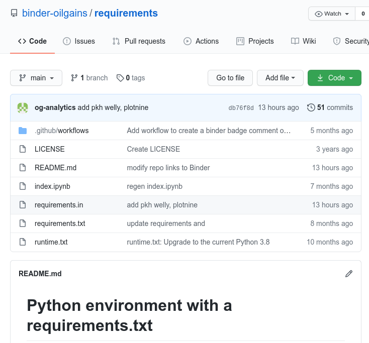
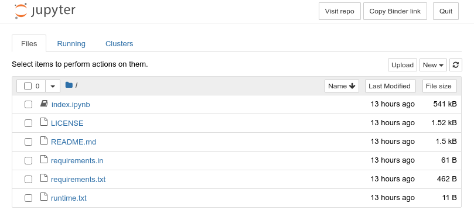
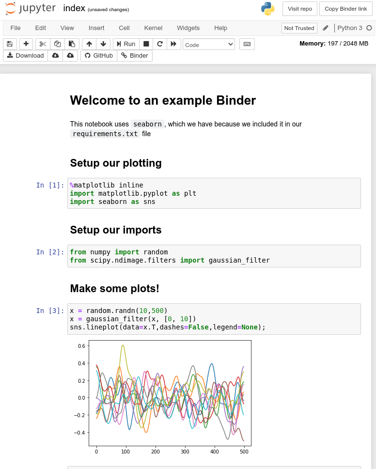

# BUILD

[toc]

----


## Status

Builds OK with Binder.

## Screenshots










## Push repo

```
git remote add origin git@github-oilgains:binder-oilgains/data_vis_statistics_geosciences.git
git branch -M main
git push -u origin main
```

## Installing `pip-tools`

Installing in conda environment `base` the utility `pip-tools` with:

```
pip install pip-tools
```

Then, running 
```
pip-compile requirements.in
```
will generate a new `requirements.txt`:
```yaml
#
# This file is autogenerated by pip-compile
# To update, run:
#
#    pip-compile requirements.in
#
cycler==0.10.0
    # via matplotlib
importlib-resources==5.1.0
    # via -r requirements.in
joblib==1.0.0
    # via scikit-learn
kiwisolver==1.2.0
    # via matplotlib
lasio==0.28
    # via welly
matplotlib==3.2.1
    # via
    #   -r requirements.in
    #   seaborn
    #   striplog
    #   welly
numpy==1.18.5
    # via
    #   -r requirements.in
    #   lasio
    #   matplotlib
    #   pandas
    #   scikit-learn
    #   scipy
    #   seaborn
    #   striplog
    #   welly
pandas==1.0.4
    # via
    #   -r requirements.in
    #   seaborn
pyparsing==2.4.7
    # via matplotlib
python-dateutil==2.8.1
    # via
    #   matplotlib
    #   pandas
pytz==2020.1
    # via pandas
scikit-learn==0.24.1
    # via -r requirements.in
scipy==1.4.1
    # via
    #   scikit-learn
    #   seaborn
    #   striplog
    #   welly
seaborn==0.10.1
    # via -r requirements.in
six==1.15.0
    # via
    #   cycler
    #   python-dateutil
striplog==0.8.8
    # via welly
threadpoolctl==2.1.0
    # via scikit-learn
tqdm==4.56.0
    # via welly
welly==0.4.9
    # via -r requirements.in

```